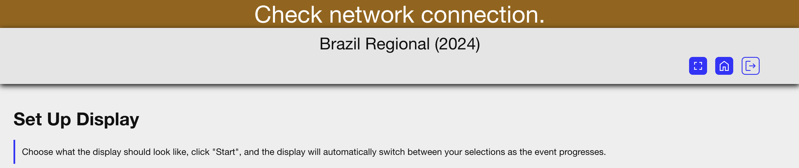

# Day -1 and 0 (Typically Wed/Thurs)
{: .no_toc }

You'll want to get everything below done before teams start loading in to the pits. Yes, it's a lot to do, but you got this.

1. TOC
{:toc}
 
This document lists the needed AV tasks to ready the AV equipment for a *FIRST* in Michigan FRC district competition. The startup of the AV computer and its tasks can be found in [Setting Up the FiM AV System](../setting-up-the-fim-av-system).

## Hardware in Your FiM AV Setup

Check out [Hardware Photos](hardware-photos) for a look at what all of the cases in the FiM AV setup look like.

 
## Field – Main Gym 
 
### AV Cart Location

Discuss/confirm location of AV cart and Field system with FTA. Typically, it is placed near the middle point of the field next to the scoring table. The AV cart and Field cart are placed with a small walkway between them. 

### Internet Connection

Locate the internet connection to be used. If the venue has not supplied an ethernet cable to the scoring table, run a cable from the jack as needed. Consult with FTA and Lead Queuing as needed to consider cable paths. For most events, internet will be run into a network box managed by the FTAs and then will run in to port 7 on the AV cart. This cable will provide internet access and access to the field network.
 
### Power

Connect the AV cart to power on a separate circuit from the *FIRST* field. If you have an exposed power outlet on the back of the AV cart, consider putting gaff tape over it (plugging a phone into this outlet is okay, but a vacuum cleaner will pop the circuit breaker).
 
### Screen

Screen assembly and location vary by venue. In many cases, it will be done by the rental company and/or venue employees. In a few cases you will need to assemble the screen (or supervise it). A frame is assembled, then the screen is snapped to it much like a truck cover. It should be flown (hung from the ceiling). 
 
{: .note }
White screens are for front projection, grey screens are for rear projection. The screens have been found in mislabeled bags in the past. 

### Projector

The projector is a minimum 12000 lumens with a short throw lens. SDI input is preferred as this is what the AV cart supplies. Converter boxes may be used as needed. The projector should be flown.

In many venues, an elevated track runs around the outside walls. The projector can be placed on a high cart on either short end in this case. If using this method, block off the area and place signage.

At many events the rental company handles the setup of the projector. Verify with your Event Coordinator. Connect the SDI for the projector to the SDI-to-HDMI converter in the back of the AV cart. 
 
### Field Sound

The AV cart has 2 wireless mics and a mixer which can be managed using the X-AIR Edit app. Use the Main L output to feed the venue or rented sound system. A long XLR cable is located in the AV Tote. Try to assign one microphone to the emcee and the other to the GA to make your life easier managing audio levels.

### Camera

There are 2 cameras provided with the FiM AV system – both PTZ (Pan Tilt Zoom). The PTZ cameras can be controlled in vMix using the PTZ Optics VISCA UDP protocol. A camera should be positioned mid-field, back far enough to capture the whole field. Many times this is a tripod positioned at the top of the bleachers. Secure as needed. A mounting arm is also provided for use if you are *safely* able to do so. Our standards during match play are holding that long shot through the whole match, with the scoring display on the top of the screen and realtime rankings at the bottom. When the match isn't running, use as much creativity with camera angles as you'd like.

The cameras need one ethernet cable run to each. There are 150 foot spools in the AV Tote. Connect the camera ethernet to ports 14 and 15 on the switch. Make a note of the IP addresses the cameras are labeled with, as you'll need them when setting up vMix.

{: .note }
A network diagram PDF document can be found on the Windows desktop of the AV computer.  
 
 
## Pit Area  - Aux Gym 
 
### Audio 

In most venues, the pit area has a PA system and mic that can be used for pit area announcements. Verify with your Event Coordinator. A small rental or donated PA can be used. Powered speakers with a wireless mic are a good option. 
 
### Network Connection 
Using a hardwired ethernet connection for the pit displays is recommended, but they can be connected to wi-fi if a hardwired connection is not available. A connected laptop at the Pit Admin table is very helpful as they can monitor the queueing needed by viewing the match live stream.
 
### Pit and Queueing Display
A large screen display or projector is setup for the Pit and Queueing displays. This is typically near Pit Admin and Inspection. There is a mini PC in the AV tote with two HDMI ports, or a laptop can be used for these displays. Refer to [Pit Display Setup](../pit-displays) for more information on setting up the displays. If you are not connected to the internet, you will get a standard error from Chrome or an orange bar will be displayed at the top of the FiM Queueing app.

## You're Set Up!

Congrats, the hardest part is done. It's time to make your way over to [Setting up the FiM AV System](../setting-up-the-fim-av-system). It walks you through what you need to do to get the computer in the AV cart set up for streaming.
