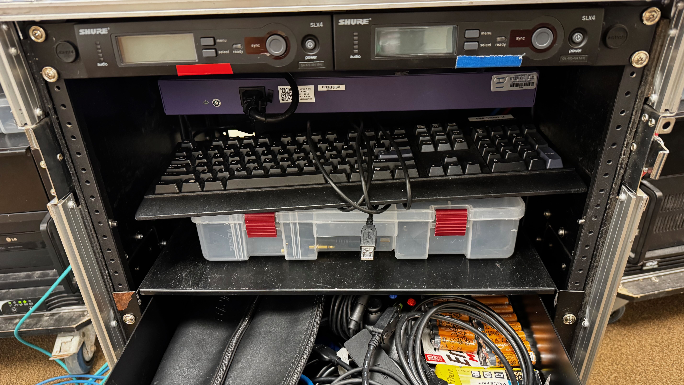
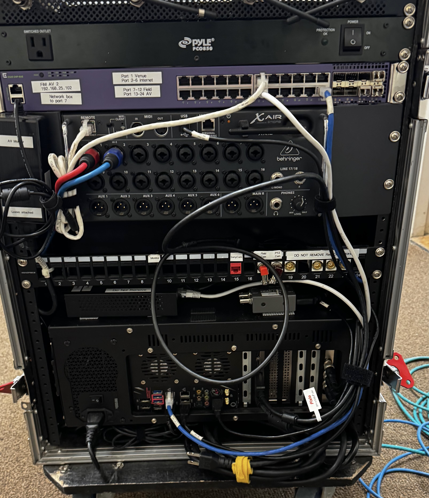
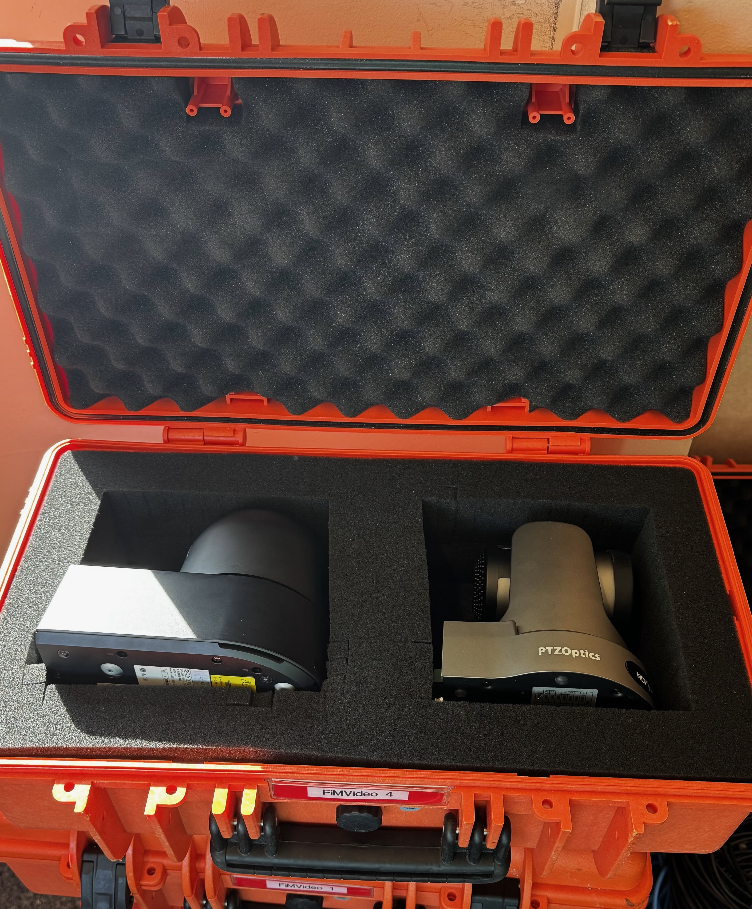
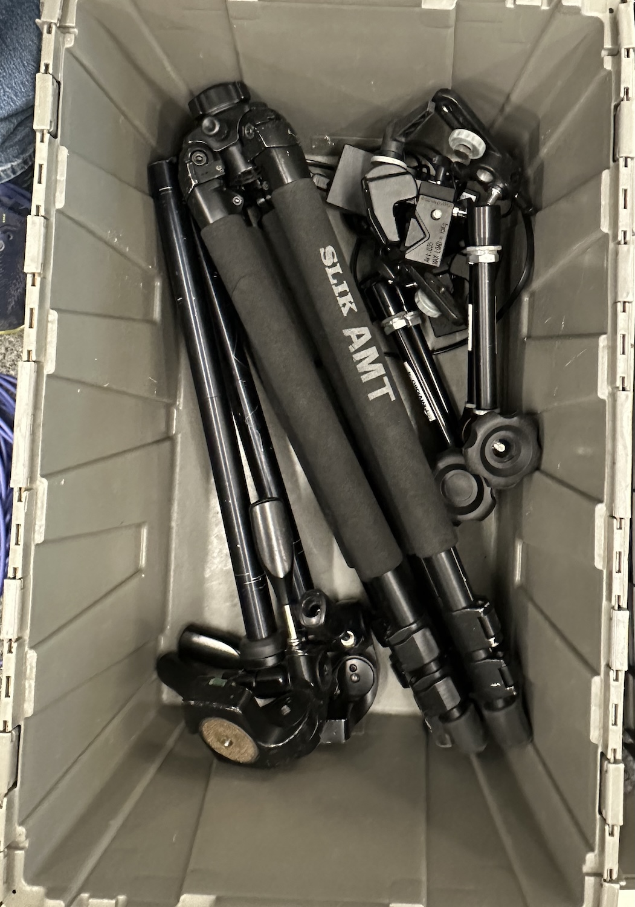
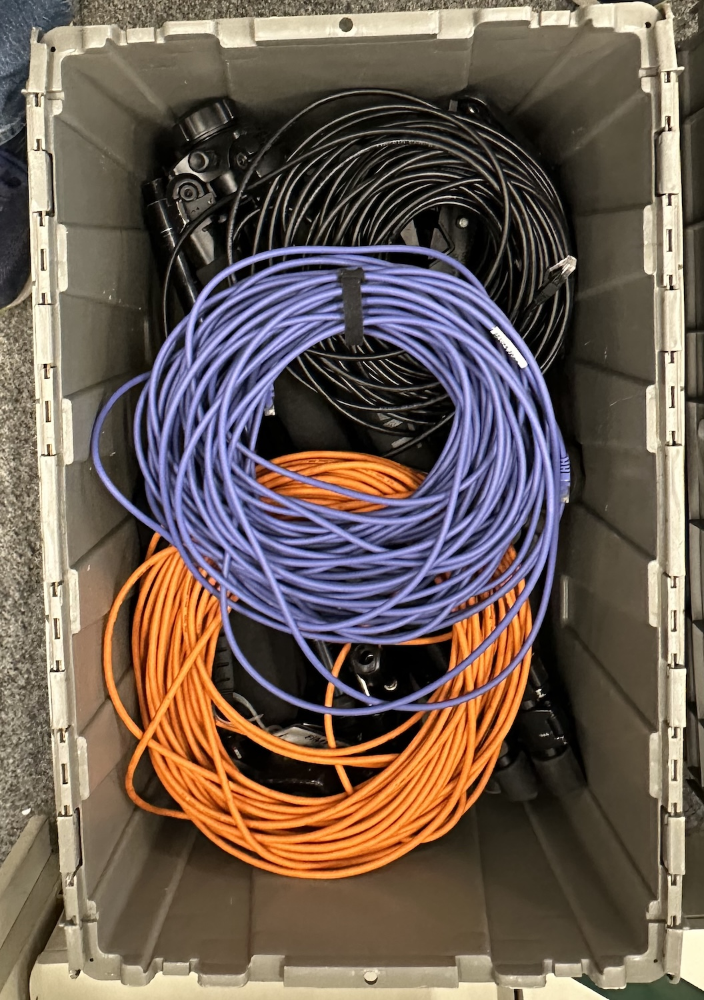
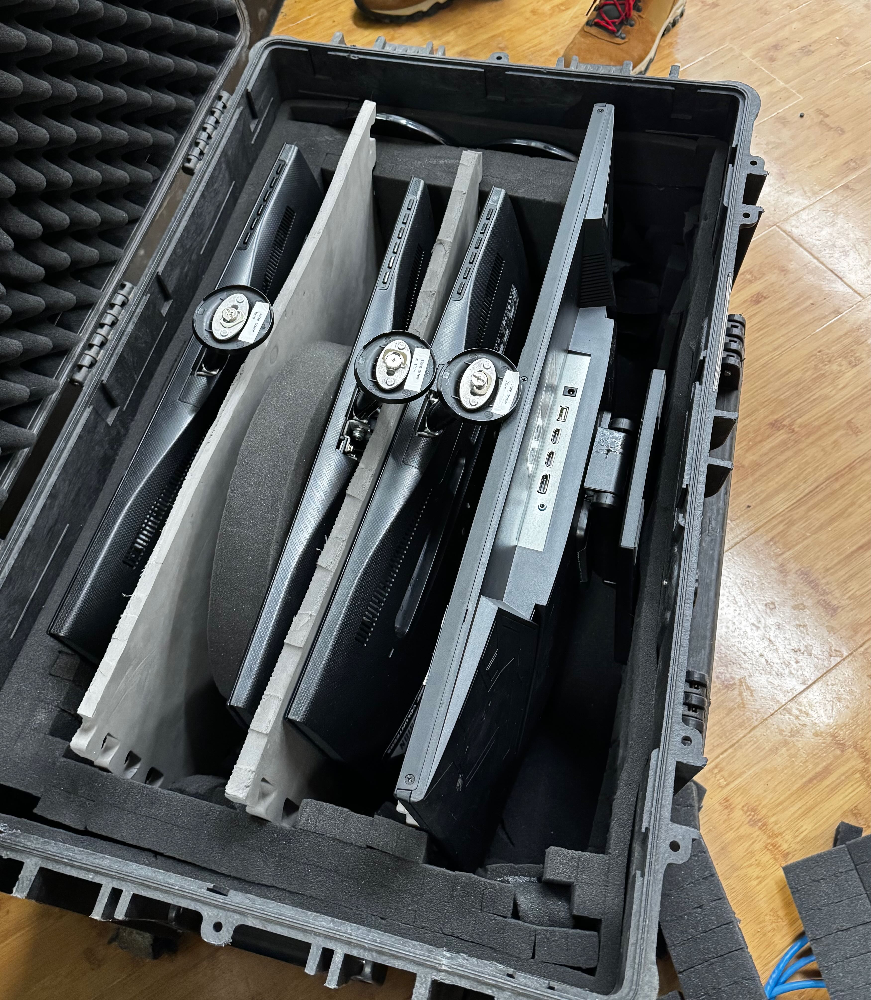

# Hardware Photos

## AV Cart

*Shown packed. This is how the cart should look before closing it up at the end of the event*

## Camera Case

## AV Tote

The tote should contain two tripods (with center pole separated from tripod legs), two camera mounting arms, one pit TV computer, two ethernet cables, one XLR cable, and a Sony camera power supply, packed as shown below:

    

        
        
Tote before cables

    

    

        
        
Tote with cables

    

## Monitor Case

Note: The larger monitor is dedicated to the AV cart. Please ensure there is some padding between the monitors so they don't get scratched.

## DJ Laptop

This is found in a laptop bag with a DJ label on it. It gets stored in the banner tote along with other event laptops.