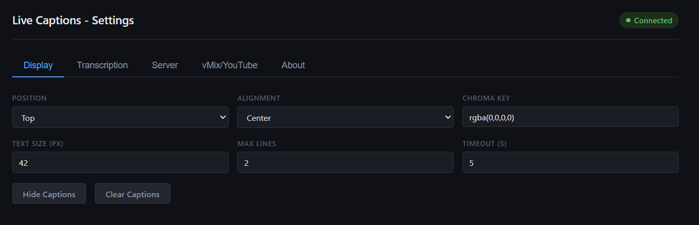
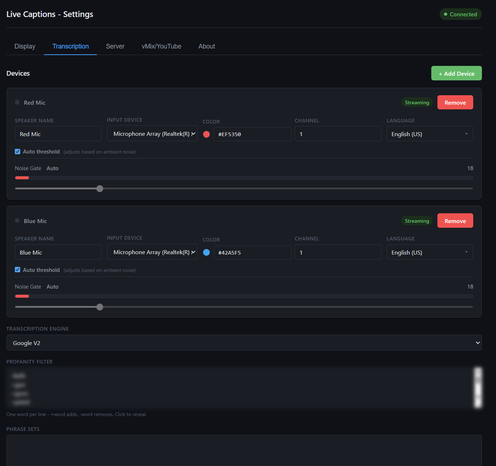
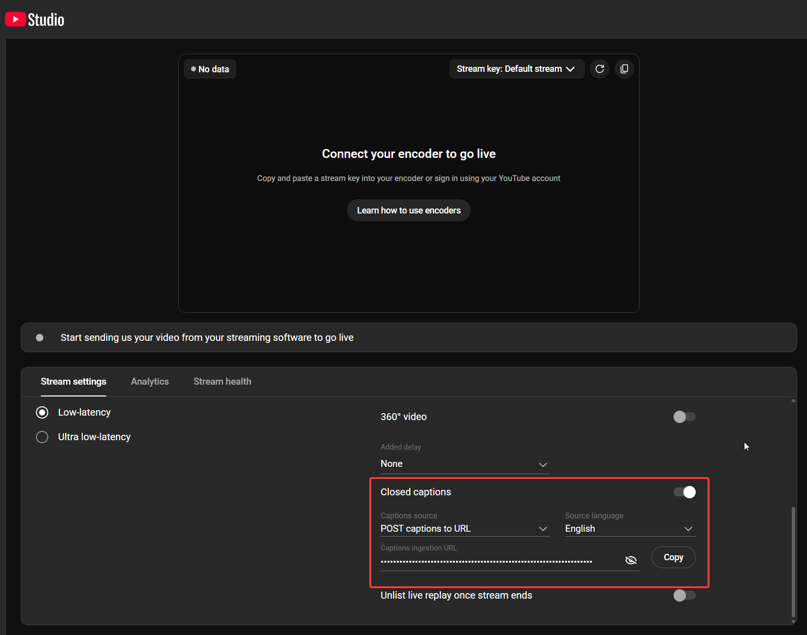
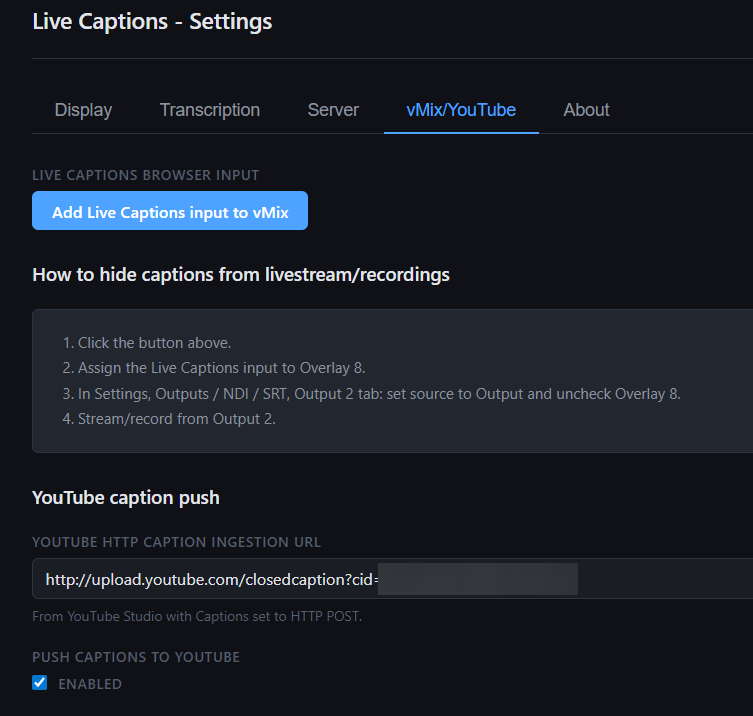
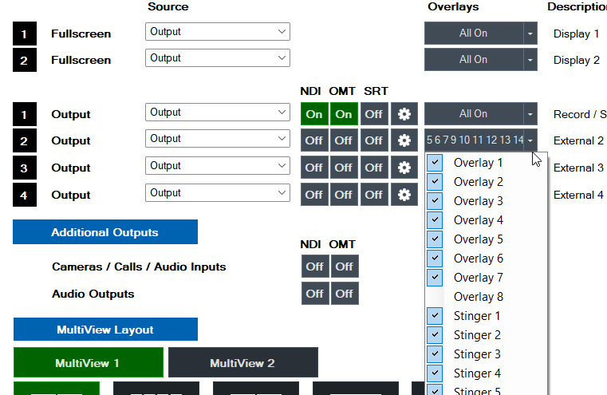
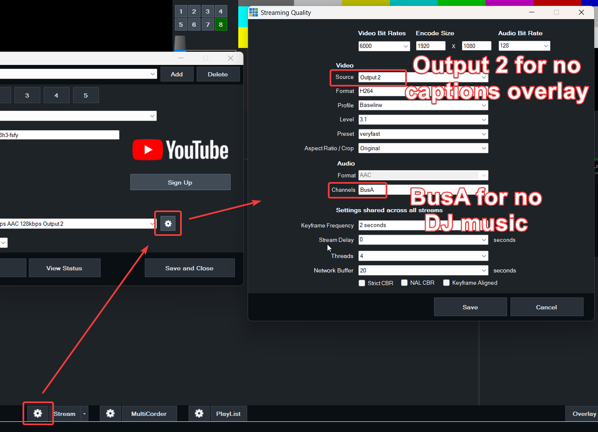
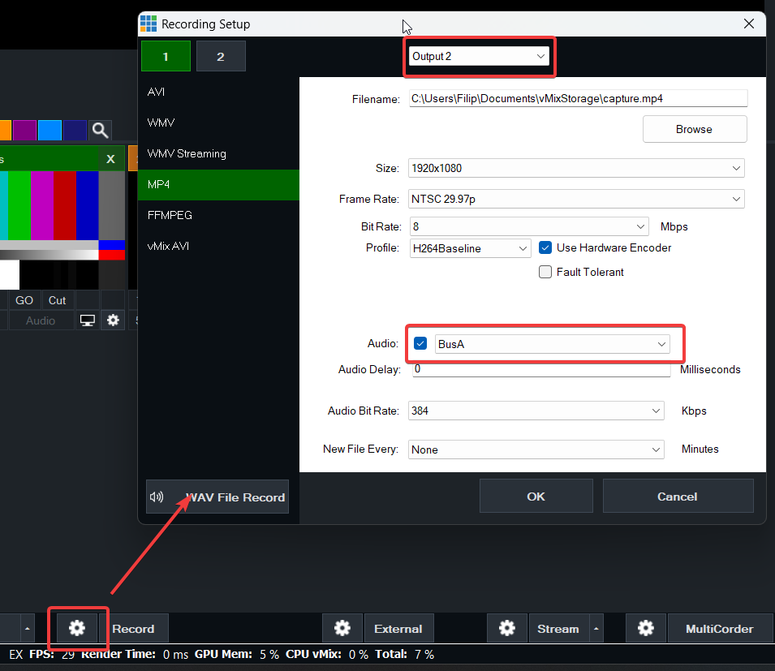

# FiM Captions Guide
{: .no_toc }

1. TOC
{:toc}

{: .note }
This guide covers the setup and troubleshooting of captions for FiM events.

## Adding the Captions to vMix
The input needed to overlay captions in vMix can be automatically added from the AV Assistant menu **vMix > Add Live Captions input**

Set the captions input as the 8th overlay, it should be the highest overlay so that it is visible on top of FMS when scores are posted.

Alternatively, you can add the captions input manually by clicking the `Add Input` button in the bottom left of the vMix window, then selecting `Browser` from the dropdown menu. The URL for the input is `http://localhost:3000/`.

## Captions Settings

Opening the captions settings can be done from the same menu in AV Assistant as was used to add the input.

It's recommended to set the chroma key to `rgba(0,0,0,0)` to make the background transparent, that way you don't have to use the chroma key in vMix to key out the background.

It's recommended to place the captions on the bottom or top, depending on where the audience display bar is placed. The captions should be on the opposite side from the audience display bar to avoid overlap.

On the transcription page, you can set what devices the caption software is listening to and what color each device's captions appear as. Each device has an **Auto threshold** checkbox (on by default) - the noise gate adjusts itself to the ambient noise floor, so manual tuning is rarely needed. Uncheck it to set a fixed threshold with the slider underneath.

The captions are very sensitive, so even if someone is holding a microphone away from their face, the software will still pick up what they're saying.

Make sure to click apply for any changes made on this page.

There's the transcription engine selection, it's recommeneded to keep this as Google V2. Although if your venue is having problems with the internet connection you can try using the April ASR engine. There is some additional setup required for the April ASR engine, so contact the  if you feel you need to use the local transcription engine.

## Watchdog (automatic recovery)

If captions stop arriving while the microphone is still picking up speech, the display page reloads itself after roughly 30 seconds. If a reload doesn't bring captions back, the watchdog triggers a full server restart on the next strike. This is automatic and recovers most stuck states without operator intervention.

The watchdog can be turned off with the **Watchdog** checkbox at the bottom of the Transcription page if it's misbehaving - see troubleshooting below.

## Troubleshooting Common Issues

### The captions are not showing up
Visit [the captions page](http://localhost:3000/) in your browser to see if the sotware is running, and if captions show up there.
- If the page does not load, there is a problem with the software.
    - Try restarting the captions from AV Assistant from the Addons menu.
    - If that doesn't fix the issue try restarting AV Assistant. Press `ctl`+`alt`+`shift`+`x` to exit AV Assistant. Then open FiMAV Assistant again from the start menu or from the icon on the desktop.
    - Refresh the page you opened in the browser to see if it comes back now. If it does, the only thing left is to right click the input in vMix and click Reload.
    - If the page still doesn't load, you can try running captions manually. Open file explorer and go to `%appdata%\us.fimav.assistant`
    - Double click the `live-captions-{VERSION}.exe` file to run the software. If a terminal window opens and immedietly closes, there is a problem causing it to crash. Contact the  for further assistance.
- If the page does load, but captions are not showing up, there is a problem with the vMix input.
    - Right click the captions input in vMix and click Reload.
    - If that doesn't fix the issue, try removing the input and re-adding it.
    - If the issue persists, contact the  for further assistance.

### Captions keep reloading or the server keeps restarting
If the watchdog is firing repeatedly - display reloads in a loop, or the server restarts every minute or two - turn it off and report it. On the **Transcription** page in captions settings, uncheck the **Watchdog** checkbox at the bottom. Captions will stop auto-recovering but the underlying issue won't be masked, which makes it easier to diagnose. Contact the  so we can look at why it's tripping.

## YouTube Caption Push

Captions can be pushed directly to YouTube so they appear as proper closed captions in the viewer, and you don't have to bake in the captions which can obstruct the view for viewers who don't need them.

1. In YouTube Studio, when scheduling the live broadcast, scroll to **Stream settings** and turn on **Closed captions**. Set Captions source to **POST captions to URL** and copy the **Captions ingestion URL**.

   

2. Open the live-captions settings page, **vMix/YouTube** tab. Paste the URL into **YouTube HTTP caption ingestion URL** and check **Enabled**.

   

Captions stream to YouTube while the broadcast is live. The toggle and URL persist across restarts. The status panel shows the last push time, queue depth, and last error if YouTube rejects anything.

Twitch closed captions are not supported at this time.

## Hiding Captions from Stream/Recording

To keep captions visible on the projector/screen in the venue but exclude them from the livestream and recording, put Overlay 8 on Output 1 only and stream/record from Output 2.

1. In vMix, open **Settings > Outputs / NDI / SRT**. On the **Output 2** row, set Source to **Output** and open the Overlays dropdown, then uncheck **Overlay 8**.

   

2. Open **Streaming Quality settings** (gear next to Stream) and set Source to **Output 2**.

   

3. Open **Recording Setup** (gear next to Record) and set the output to **Output 2**.

   

Output 1 remains the in-venue display with captions; Output 2 is the clean feed without them.
