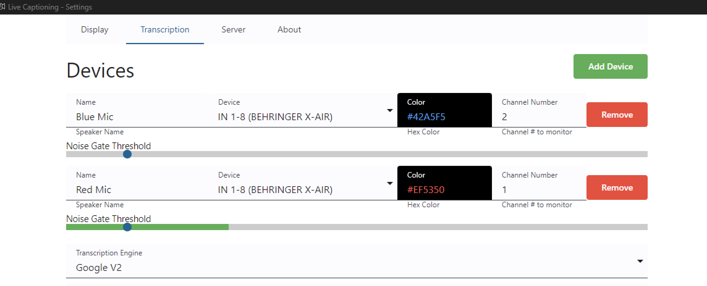

# FIM Captions Guide
{: .no_toc }



1. TOC
{:toc}

{: .note }
This guide covers the setup and troubleshooting of captions for FIM events.

## Adding the Captions to vMix
The input needed to overlay captions in vMix can be automatically added from the AV Assistant menu "vMix > Add Live Captions input"

Set the captions input as the 4th overlay, it should be the highest overlay so that it is visible on top of FMS when scores are posted.

Alternatively, you can add the captions input manually by clicking the `Add Input` button in the bottom left of the vMix window, then selecting `Browser` from the dropdown menu. The URL for the input is `http://localhost:3000/`.

## Captions Settings

Opening the captions settings can be done from the same menu in AV Assistant as was used to add the input.

It's recommended to set the chroma key to `#00000000` to make the background transparent, that way you don't have to use the chroma key in vMix to key out the background.

It's recommended to place the captions on the bottom or top, depending on where the audience display bar is placed. The captions should be on the opposite side from the audience display bar to avoid overlap.

On the transcription page, you can set what devices the caption software is listening to. What color that device's captions will appear as, and there's a noise gate slider to help filter out background noise. The captions are very sensitive, so even if someone is holding a microphone away from their face, the software will still pick up what they're saying.

Make sure to click apply for any changes made on this page.

There's the transcription engine selection, it's recommeneded to keep this as Google V2. Although if your venue is having problems with the internet connection you can try using the April ASR engine. There is some additional setup required for the April ASR engine, so contact #av-help if you feel you need to use the local transcription engine.

## Troubleshooting Common Issues

### The captions are not showing up
Visit [the captions page](http://localhost:3000/) in your browser to see if the sotware is running, and if captions show up there.
- If the page does not load, there is a problem with the software.
    - Try restarting the captions from AV Assistant from the Addons menu.
    - If that doesn't fix the issue try restarting AV Assistant. Press `ctl`+`alt`+`shift`+`x` to exit AV Assistant. Then open FIMAV Assistant again from the start menu or from the icon on the desktop.
    - Refresh the page you opened in the browser to see if it comes back now. If it does, the only thing left is to right click the input in vMix and click Reload.
    - If the page still doesn't load, you can try running captions manually. Open file explorer and go to `%appdata%\us.fimav.assistant`
    - Double click the `live-captions-1.7.4.exe` file to run the software. If a terminal window opens and immedietly closes, there is a problem causing it to crash. Contact #av-help for further assistance.
- If the page does load, but captions are not showing up, there is a problem with the vMix input.
    - Right click the captions input in vMix and click Reload.
    - If that doesn't fix the issue, try removing the input and re-adding it.
    - If the issue persists, contact #av-help for further assistance.

