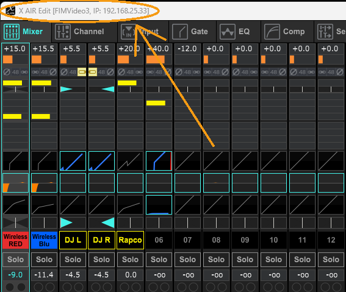
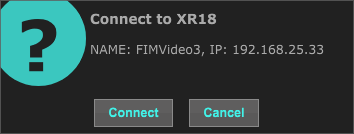
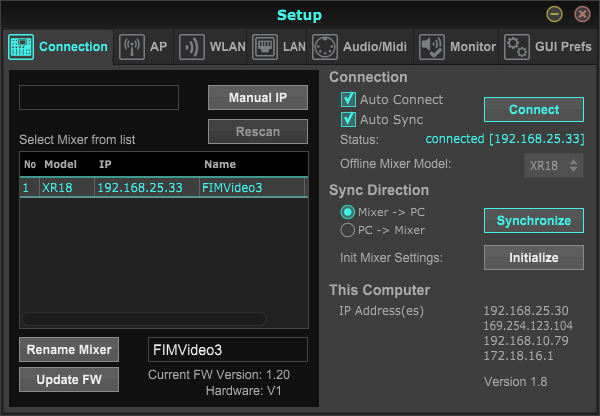
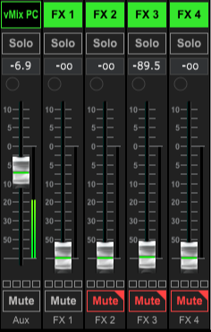
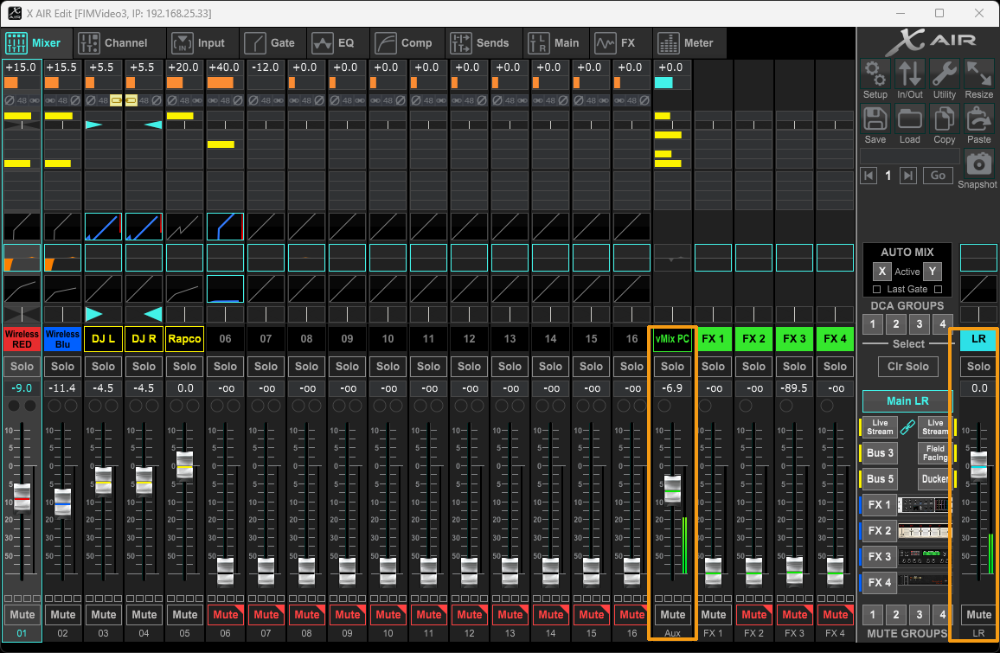
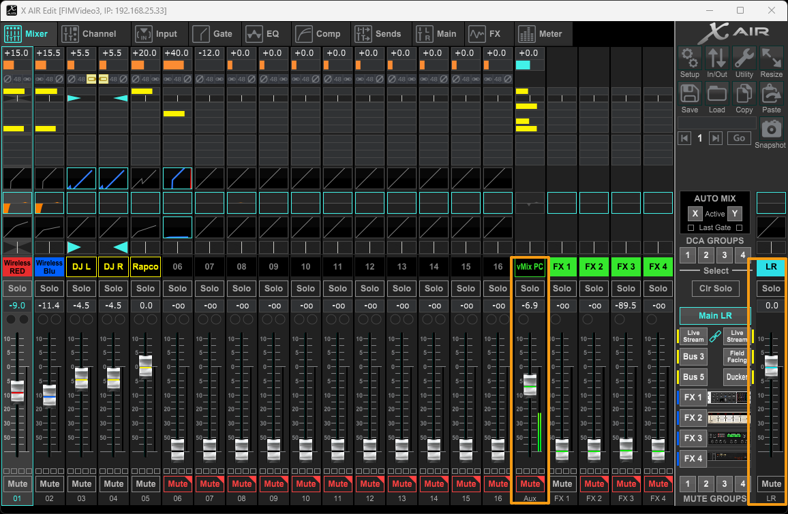
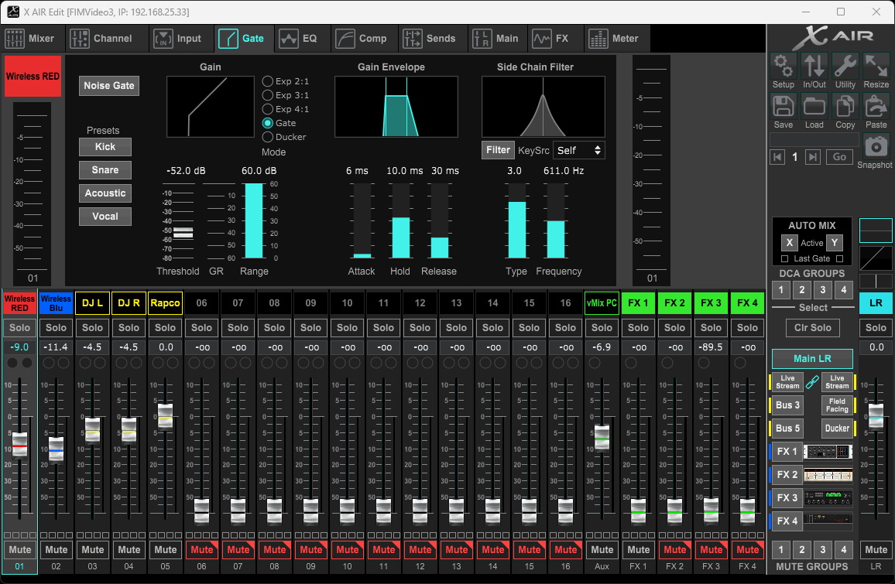
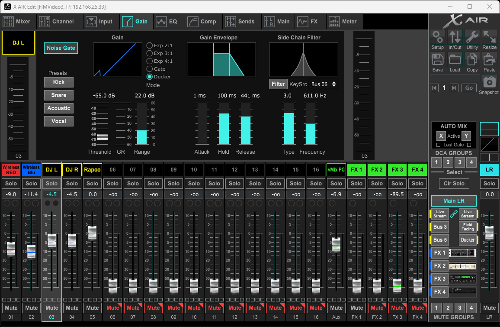

# xAir Audio Guide
{: .no_toc }



1. TOC
{:toc}

{: .note }
This guide covers the software side of AV audio (xAir), NOT the physical configuration.

### Connecting to the Mixer
The mixer should connect automatically. If it is already connected, you will see the IP address of the mixer in the top left of the window.

You may also get a prompt like this: 

**Be sure to always transfer Mixer -> PC!**

It is also key to make sure that auto connect is turned on (it should be by default, but in case it isn't) click on the 'Setup' button on the right side of xAir, then verify that your settings look like this

 
## Controlling an Input
 
### 1. Audio Levels

To the right of each input/output is a corresponding audio level indicator. This will let you know if an input is receiving audio, generally just make sure that the audio level is not in the red.

This is what a good audio level on an input should look like.

For more info on audio volume, refer to [Audio Volume](../../audio-volume)
 
### 2. Mute

Each input and output, will have a mute button under it. If its red then its muted, otherwise it is unmuted.

When an input is muted, it will still have a visible audio level, however it will stop sending audio to ***ALL*** Buses!

*Unmuted*

*Muted*

If you want to just remove an audio source on a single bus (For Example: the Live Stream bus), slide the fader on that input all the way down the bottom on that fader instead of muting it.
 
### 3. Noise Gate
The noise gate is an audio setting that can be applied to any input which will cut off any sound below a certain threshold. For FiM's usage, we apply noise gates most notably on the Red and Blue Mic Inputs. This will help to cut out background noise since most background noise will be below the preset threshold.

You can enable / disable 

### 4. Pan
!TODO

## Ducker
!TODO

## Troubleshooting Common Issues
!TODO
