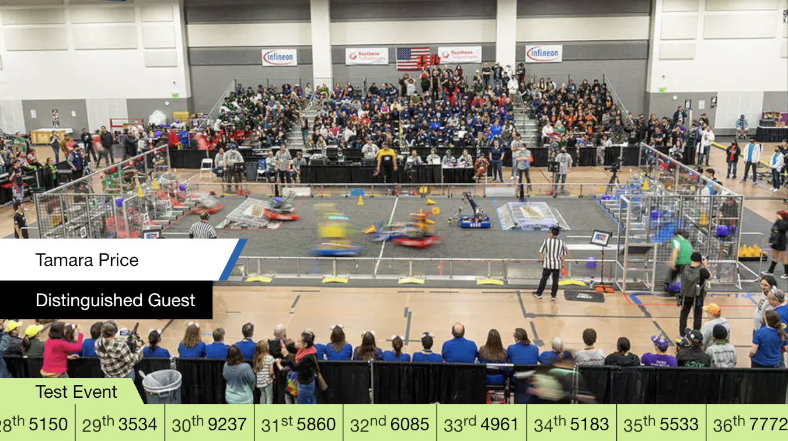
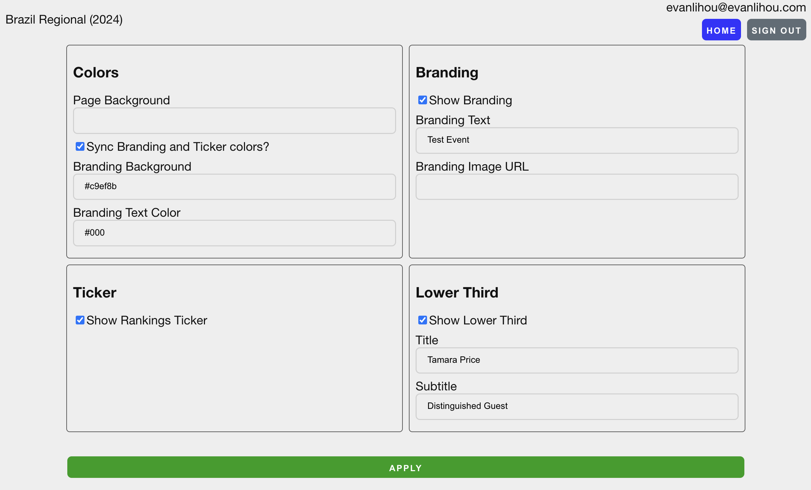

# What&apos;s New in 2024
{: .no_toc }

## Pit Displays

FiM's custom pit displays are largely unchanged for the 2024 season. They have been updated to reflect the new break schedule in the playoffs.

## Stream Graphics

FiM's stream graphics solution has gained more functionality this season, allowing you to change the graphics on the fly without needing to do anything inside of vMix. Simply add a web browser input with the following URL:

`https://q.fimav.us/overlay?key=YOURKEYHERE` where "YOURKEYHERE" is the same event key you use to set up the pit displays.

*A screenshot of the overlay with some options enabled*

A page has been added to allow management of these graphics, where you can make as many changes as you want, and they'll all go live at once when "apply" is clicked. Only official FiM AV Google accounts have access to this functionality, if you want your personal account to have permission for your specific event, please request it in #av-private in Slack.

The management interface can be found at `https://q.fimav.us/manage/options`.

*A screenshot of the mangement interface for the overlay*

Additional improvements to the stream graphics are expected to come throughout the season.

## AV Assistant

A new application is being added to the AV carts this season, which we're calling "AV Assistant". As the project grows, it'll help you go through the event setup process step-by-step. In its current form, it allows AV leads to send time-sensitive alerts directly to your cart, and provides some helpful data to make troubleshooting issues easier.

## And More

We're always improving the AV volunteer experience, both during the season and off-season. There may be some additional small changes to equipment or tools.