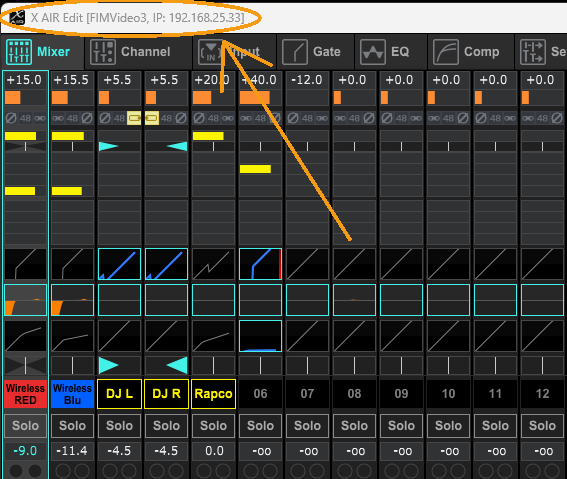
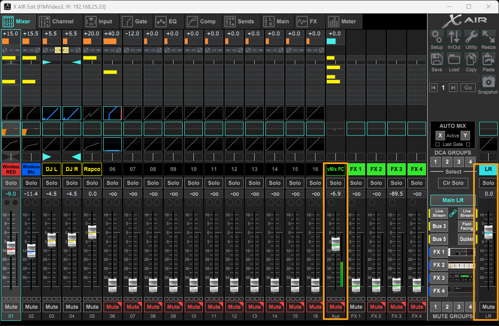

# xAir Audio Guide
{: .no_toc }

1. TOC
{:toc}

{: .note }
This guide covers the software side of AV audio (xAir) NOT the physical configuration.

### Connecting to the Mixer
The mixer should connect automatically. If it is already connected, you will see the IP address of the mixer in the top left of the window.

You may also get a prompt like this: 

**Be sure to always transfer Mixer -> PC!**

It is also key to make sure that auto connect is turned on (it should be by default, but in case it isn't) click on the 'Setup' button on the right side of xAir, then verify that your settings look like this

 
## Controlling an Input
 
### 1. Audio Levels

To the right of each input/output is a corresponding audio level indicator. This will let you know if an input is receiving audio, generally just make sure that the audio level is not in the red.

This is what a good audio level on an input should look like. 

For more info on audio volume, refer to [Audio Volume](../audio-volume)
 
### 2. Mute

Each input, and output on the right side of the faders, will have a mute button under it. If its red then its muted, otherwise it is unmuted. 

When an input is muted, it will still have a visible audio level, however it will stop sending audio to ***ALL*** Buses! 

**Unmuted** 

**Muted** 

If you want to just remove an audio source on a single bus (For Example: the Live Stream bus), slide the fader on that input all the way down the bottom on that fader instead of muting it.
 
### 3. Noise Gate
The noise gate is an audio setting that can be applied to any input which will cut off any sound below a certain threshold. For FiM's usage, we apply noise gates most notably on the Red and Blue Mic Inputs. This will help to cut out background noise since most background noise will be below the preset threshold. 

You can enable / disable 

### 4. Pan
- Load in your stream keys with FIMAV Assistant. Open FIMAV Assistant, and in the vMix menu click on "Set Stream Keys".
- In the stream settings window (the gear next to the stream icon) check that your quality includes "1080p" and "BusA".
- Click the Stream button. After a few seconds, it should turn red and stay red until stopped by clicking the button again. A notification should be sent to the #av-alerts channel in Slack saying that your channel went live on Twitch. If that alert is not sent, or it shows the wrong Twitch channel, it means something is wrong with your stream.
- Notes about streaming 
    - The Audio input 17+18 sends the mixer output from Bus 1 into vMix assigned to Bus A 
    - Bus A is configured for both the Stream and Record functions. 
    - There is a sound diagram in the AV folder shortcut on the desktop

## Ducker

You're ready to run an event! Before you go home for the night, take a look at [Day 1 and 2](../day-1-and-2). It has a few quick steps you'll want to follow to set yourself up for a successful opening ceremony.

## Troublshooting Common Issues